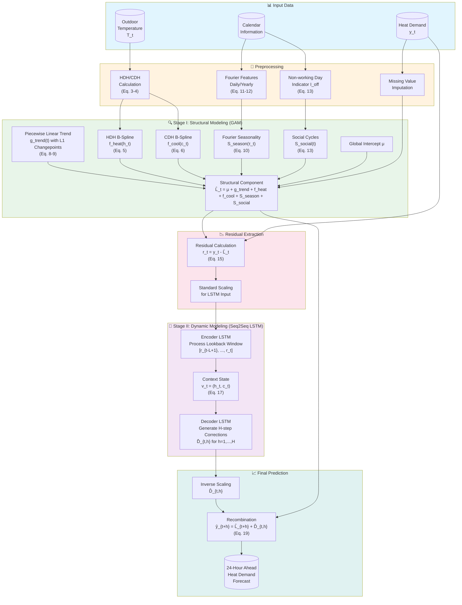

# GLAM: A Hybrid GAM-LSTM Framework for District Heat Demand Forecasting

[](https://www.python.org/downloads/)
[](https://pytorch.org/)
[](https://github.com/astral-sh/uv)
[](https://opensource.org/licenses/MIT)

## 📋 Overview

**GLAM (GAM–LSTM Additive Model)** is a two-stage hybrid forecasting framework for district heating demand prediction. It combines the interpretability of Generalized Additive Models (GAM) with the temporal learning capability of Sequence-to-Sequence LSTM networks.

### Key Innovation
GLAM explicitly separates **deterministic structural patterns** from **stochastic residual dynamics**, enabling:
- 🎯 **Interpretable** structural components (weather response, seasonality, trends)
- 🧠 **Accurate** residual dynamics modeling via deep learning
- ⏰ **Multi-horizon** forecasting for day-ahead operational planning (24-hour horizon)

---

## 🏗️ Architecture



---

## 📐 Mathematical Formulation

### Core Decomposition (Eq. 1)
The heat demand is decomposed as:

$$y_t = L_t + D_t + \epsilon_t$$

Where:
- $L_t$: Structural component (deterministic patterns)
- $D_t$: Dynamic residual (stochastic temporal dependence)
- $\epsilon_t$: White noise

### Stage I: Structural Component (Eq. 2)

$$L_t = \mu + g_{\text{trend}}(t) + f_{\text{heat}}(h_t) + f_{\text{cool}}(c_t) + S_{\text{season}}(\tau_t) + S_{\text{social}}(t)$$

| Component | Description | Equation |
|-----------|-------------|----------|
| $\mu$ | Global intercept | Baseline level |
| $g_{\text{trend}}(t)$ | Piecewise linear trend | $\beta_1 t + \sum_{j=1}^{K} \delta_j (t - c_j)_+$ |
| $f_{\text{heat}}(h_t)$ | HDH nonlinear response | Penalized B-spline (Eq. 5) |
| $f_{\text{cool}}(c_t)$ | CDH nonlinear response | Penalized B-spline (Eq. 6) |
| $S_{\text{season}}(\tau_t)$ | Daily + Yearly seasonality | Fourier terms (Eq. 11-12) |
| $S_{\text{social}}(t)$ | Weekend/Holiday effects | $\gamma_{\text{off}} \cdot I_{\text{off}}(t)$ |

### Weather Encoding (Eq. 3-4)

$$h_t = \max(0, T_{\text{base}} - T_t) \quad \text{(Heating Degree Hours)}$$

$$c_t = \max(0, T_t - T_{\text{base}}) \quad \text{(Cooling Degree Hours)}$$

Where $T_{\text{base}} = 18°C$

### Stage II: Seq2Seq LSTM

The encoder-decoder architecture:

1. **Encoder**: Processes lookback window of residuals
   $$v_t = \text{Encoder}([r_{t-L+1}, ..., r_t]) = (h_t, c_t)$$

2. **Decoder**: Generates multi-horizon corrections
   $$\hat{D}_{t,h} = \text{Decoder}(v_t) \quad \text{for } h = 1, ..., H$$

3. **Final Prediction** (Eq. 19):
   $$\hat{y}_{t+h} = \hat{L}_{t+h} + \hat{D}_{t,h}$$

---

## 📁 Project Structure

```
GLAM/
├── 📓 GLAM_sector_1.ipynb       # Main implementation notebook
├── 📄 README.md                 # This file
├── 📦 pyproject.toml            # Project configuration & dependencies
├── 🔒 uv.lock                   # Locked dependencies (auto-generated)
├── 📊 data/
│   └── whole-CHP-plant-data-ver2.csv  # Heat demand dataset
└── 📈 results/
    └── best_lstm_model.pth      # Trained model weights
```

---

## 🚀 Quick Start

### Prerequisites

This project uses [**uv**](https://github.com/astral-sh/uv) for fast, reliable Python package management.

#### Install uv

```bash
# macOS / Linux
curl -LsSf https://astral.sh/uv/install.sh | sh

# Windows (PowerShell)
powershell -ExecutionPolicy ByPass -c "irm https://astral.sh/uv/install.ps1 | iex"

# Or via Homebrew (macOS)
brew install uv
```

### Installation

```bash
# 1. Clone the repository
git clone https://github.com/your-username/GLAM.git
cd GLAM

# 2. Sync dependencies (creates venv and installs all packages)
uv sync

# 3. (Optional) Install development dependencies
uv sync --all-extras
```

### Running the Notebook

```bash
# Activate the virtual environment and run Jupyter
uv run jupyter notebook GLAM_sector_1.ipynb

# Or use JupyterLab
uv run jupyter lab
```

---

## 📦 Dependencies

All dependencies are managed via `pyproject.toml`:

| Package | Version | Purpose |
|---------|---------|---------|
| `numpy` | ≥1.24.0 | Numerical operations |
| `pandas` | ≥2.0.0 | Data manipulation |
| `torch` | ≥2.0.0 | Deep learning framework |
| `pygam` | ≥0.9.0 | Generalized Additive Models |
| `workalendar` | ≥17.0.0 | Korean holiday calendar |
| `scikit-learn` | ≥1.3.0 | ML utilities |
| `matplotlib` | ≥3.7.0 | Visualization |
| `seaborn` | ≥0.12.0 | Statistical visualization |

### Adding New Dependencies

```bash
# Add a production dependency
uv add package-name

# Add a development dependency
uv add --dev package-name

# Update all dependencies
uv lock --upgrade
```

---

## 🔧 Common uv Commands

```bash
# Sync dependencies from lock file
uv sync

# Run any Python script
uv run python your_script.py

# Run Jupyter notebook
uv run jupyter notebook

# Add a new package
uv add package-name

# Remove a package
uv remove package-name

# Update lock file
uv lock

# Show dependency tree
uv tree
```

---

## 💻 Running the Model

```python
# 1. Load and preprocess data
df = pd.read_csv('data/whole-CHP-plant-data-ver2.csv')
df['date'] = pd.to_datetime(df['date'])

# 2. Feature Engineering
df = add_fourier_features(df, 'date', P_DAILY=24, K_d=5, prefix='daily')
df = add_fourier_features(df, 'date', P_YEARLY=8766, K_y=15, prefix='yearly')
df['I_off'] = create_nonworking_indicator(df, 'date')

# 3. Stage I: GAM fitting
gam = LinearGAM(terms)
gam.gridsearch(X_train, y_train)
L_hat = gam.predict(X)

# 4. Residual extraction
residual = y - L_hat

# 5. Stage II: LSTM training
model = Seq2SeqLSTM(hidden_size=192, num_layers=1)
# Train on residuals...

# 6. Final prediction
y_pred = L_hat_future + D_hat
```

---

## 📊 Data Description

### Dataset
- **Source**: Korea Meteorological Administration (KMA) Weather Big Data Contest
- **Period**: January 2021 – December 2024
- **Resolution**: Hourly
- **Branches**: 18 district heating branches (Pyeongtaek excluded due to data quality issues)

### Variables

| Variable | Unit | Description |
|----------|------|-------------|
| Heat Demand ($D_t$) | MW | Hourly heat demand per branch |
| Outdoor Temperature ($T_t$) | °C | Hourly outdoor air temperature |
| HDH ($h_t$) | °C·h | Heating Degree Hours (engineered) |
| CDH ($c_t$) | °C·h | Cooling Degree Hours (engineered) |
| Non-working Day ($I_{\text{off}}$) | {0,1} | Weekend/holiday indicator |

### Branch Stratification

Branches are classified by Summer-to-Winter Ratio (SWR):

$$SWR = \frac{E[D_t | t \in \text{Jun-Aug}]}{E[D_t | t \in \text{Dec-Feb}]}$$

- **Case 1** (SWR < 0.25): Heating-dominant with near-baseline summer demand
- **Case 2** (SWR ≥ 0.25): Elevated summer loads with CDH response

---

## ⚙️ Hyperparameters

### Stage I (GAM)

| Parameter | Search Space | Best Value |
|-----------|--------------|------------|
| $K_d$ (Daily Fourier order) | [2, 3, 4, 5] | 5 |
| $K_y$ (Yearly Fourier order) | [5, 10, 15] | 15 |
| $K_{cp}$ (Changepoints) | [5, 10, 15, 20] | 5 |
| $n_{\text{splines}}$ (B-spline basis) | [10, 15, 20, 25] | 10 |
| $\lambda$ (Smoothing) | logspace(-3, 3, 7) | Grid search |

### Stage II (LSTM)

| Parameter | Search Space | Best Value |
|-----------|--------------|------------|
| Hidden size | [32, 64, 96, 128, 192] | 192 |
| Number of layers | [1, 2, 3] | 1 |
| Dropout | [0.0, 0.1, 0.2, 0.3] | 0.0 |
| Learning rate | [1e-4, 3e-3] | 4.6e-4 |
| Batch size | [16, 32, 64] | 64 |
| Teacher forcing ratio | [0.2, 0.4, 0.6] | 0.2 |
| Lookback window | - | 168 hours (7 days) |
| Forecast horizon | - | 24 hours |

---

## 📈 Results

### Stage I Performance (GAM Only)

| Metric | Test Set |
|--------|----------|
| RMSE | 45.13 MW |
| MAE | 36.04 MW |
| R² | 0.9408 |

### Stage I + II Performance (GLAM)

| Metric | Test Set |
|--------|----------|
| RMSE | ~28.7 MW |
| MAE | ~22.1 MW |
| R² | ~0.976 |

---

## 🔬 Key Implementation Details

### 1. Missing Value Imputation
- **Short gaps (≤2 days)**: Quadratic spline interpolation
- **Long gaps (>2 days)**: Historical averaging (same month, day, hour)

### 2. Changepoint Regularization (Eq. 9)
L1 penalty for sparse changepoints:
$$\mathcal{P}_{cp}(\boldsymbol{\delta}) = \lambda_{cp} \sum_{j=1}^{K} |\delta_j|$$

### 3. Teacher Forcing
During LSTM training, teacher forcing ratio decays to improve inference stability.

### 4. Residual Scaling
StandardScaler is applied to residuals before LSTM training for numerical stability.

---

## 📂 Detailed Pipeline Flow

```mermaid
flowchart LR
    subgraph DataPrep["1️⃣ Data Preparation"]
        A1["Load CSV Data"] --> A2["Filter by Branch<br/>(e.g., Gangnam)"]
        A2 --> A3["Time Index<br/>Assignment"]
        A3 --> A4["Train/Val/Test Split<br/>(72.7%/13.6%/13.6%)"]
    end
    
    subgraph FeatEng["2️⃣ Feature Engineering"]
        B1["HDH: max(0, 18-T)"] 
        B2["CDH: max(0, T-18)"]
        B3["Daily Fourier<br/>K_d harmonics"]
        B4["Yearly Fourier<br/>K_y harmonics"]
        B5["Korean Holiday<br/>Calendar"]
        B6["Changepoint<br/>Features (t-c_j)+"]
    end
    
    subgraph Stage1Fit["3️⃣ Stage I Fitting"]
        C1["Grid Search<br/>Hyperparameters"]
        C2["GAM Fit on Train"]
        C3["Lasso for<br/>Changepoints"]
        C4["Compute L_hat"]
        C5["Extract Residuals<br/>r = y - L_hat"]
    end
    
    subgraph Stage2Fit["4️⃣ Stage II Fitting"]
        D1["Scale Residuals<br/>(StandardScaler)"]
        D2["Create Sequences<br/>(168→24)"]
        D3["Random Search HP"]
        D4["Train Seq2Seq LSTM"]
        D5["Early Stopping<br/>on Val MSE"]
    end
    
    subgraph Inference["5️⃣ Inference"]
        E1["GAM Predict<br/>L_hat_future"]
        E2["LSTM Predict<br/>D_hat_scaled"]
        E3["Inverse Scale"]
        E4["Recombine<br/>y_hat = L_hat + D_hat"]
    end
    
    DataPrep --> FeatEng --> Stage1Fit --> Stage2Fit --> Inference
```



---

## 🔍 Interpretability Features

GLAM provides component-wise interpretability:

1. **Trend Analysis**: Visualize long-term structural changes via changepoint coefficients
2. **Weather Response Curves**: Plot $f_{\text{heat}}(h_t)$ and $f_{\text{cool}}(c_t)$ splines
3. **Seasonality Decomposition**: Examine daily and yearly Fourier components
4. **Holiday Effects**: Quantify $\gamma_{\text{off}}$ coefficient for demand reduction

---

## 📚 Citation


---

## 📬 Contact

- **Jong-Seung Lee** (Corresponding): new9279@gachon.ac.kr

**Affiliation**: Department of Next Generation Smart Energy System Convergence, Gachon University, Republic of Korea

---

## 📄 License

This project is licensed under the MIT License - see the [LICENSE](LICENSE) file for details.

---

## 🙏 Acknowledgments

- Korea Meteorological Administration (KMA) Weather Big Data Contest for providing the dataset
- Energy AX LAB at Gachon University for research support
